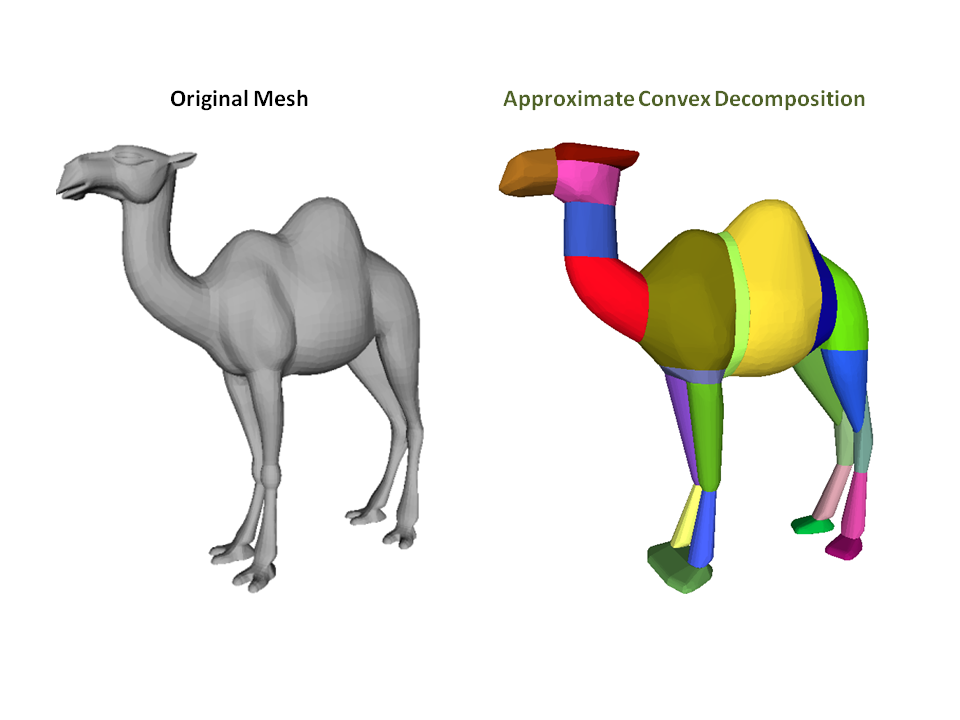

# The V-HACD library decomposes a 3D surface into a set of "near" convex parts.



# Why do we need approximate convex decomposition?

Collision detection is essential for [realistic physical interactions](https://www.youtube.com/watch?v=oyjE5L4-1lQ) in video games and computer animation. In order to ensure real-time interactivity with the player/user, video game and 3D modeling software developers usually approximate the 3D models composing the scene (e.g. animated characters, static objects...) by a set of simple convex shapes such as ellipsoids, capsules or convex-hulls. In practice, these simple shapes provide poor approximations for concave surfaces and generate false collision detection.


A second approach consists in computing an exact convex decomposition of a surface S, which consists in partitioning it into a minimal set of convex sub-surfaces. Exact convex decomposition algorithms are NP-hard and non-practical since they produce a high number of clusters. To overcome these limitations, the exact convexity constraint is relaxed and an approximate convex decomposition of S is instead computed. Here, the goal is to determine a partition of the mesh triangles with a minimal number of clusters, while ensuring that each cluster has a concavity lower than a user defined threshold.


# Installing the Package

On Windows, go to the ./app directory and run 'cmake -DCMAKE_GENERATOR_PLATFORM=x64 CMakeLists.txt' and then load the solution file

On Linux, use this:
```bash
cd app
cmake -S . -B build -DCMAKE_BUILD_TYPE=Release
cmake --build build
```

# Announcing Version 4.0 release!!

Version 4.0 of V-HACD was officially released on April 7, 2022

The previous version has been archived on a branch called 'version.3.1' should you need it.

Version 4.0 is a near complete rewrite of the V-HACD code.

The API is mostly the same with just some minor changes.

V-HACD version 4.0 is now a header file only library!  Just one source file is needed.

V-HACD version 4.0 is faster, more robust, stable, and has fewer bugs than the older version.

Going forward version 4.0 and higher are the only versions which will receive technical support.

The earlier versions are now completely deprecated and will not be supported anymore.

# Tuning parameters

The default values are currently designed to give a fast and basic approximation of a shape.

If you want as accurate results as possible and don't care if it takes quite a bit longer you can use a small error threshold (-e 0.01) and a high voxel resolution of ten million (-r 10000000) and a relatively high number of convex hulls say 128 (-h 128).

Finally you can set the maximum decomposition depth to much higher than the default value of 10. Setting it to say 15 (-d 15) will allow the algorithm to recurse much more deeply into the shape. A higher depth value requires a 64 bit build of the library.

Example: TestVHACD beshon.obj -e 0.01 -d 15 -r 10000000 -r 128

Usually this may be overkill for your use case but if you have say machined parts with sharp angles, these settings have a better chance of giving a good result.

Note that setting the maximum decomposition depth to 15 will make the tool run a very long time (possibly multiple minutes) but it will likely give the most precise results.

The default value for decomposition depth is currently ten and it goes in powers of two. So the default value considers a maximum of 1,024 hulls but with a depth of 15 it will consider 32,768 convex hull fragments.

# Porting guide

The new version is a single header file. You simply need to define '#define ENABLE_VHACD_IMPLEMENTATION 1' prior to including 'VHACD.h' in *one* CPP file in your project.

There are no link libraries for V-HACD. There are no CPP files either. Just the one header file.

The tuning parameter 'm_concavity' has been removed and is now replaced by 'm_minimumVolumePercentErrorAllowed'

The tuning parameters 'm_alpha' and 'm_beta' are gone and no longer used.

The tuning parameter 'm_projectHullVertices' has been renamed 'm_shrinkWrap'

The function signature for the Update call in IUserCallback has changed slightly to the following:

        virtual void Update(const double overallProgress,
                            const double stageProgress,
                            const char* const stage,const char *operation) final
